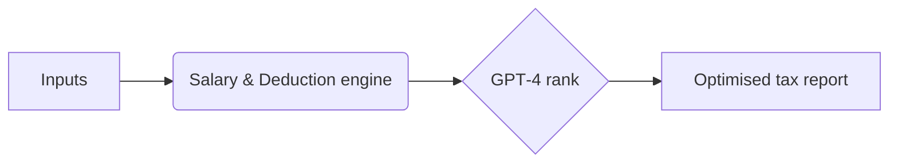

<p align="center">
  
</p>

<h1 align="center">Tax Sage AI 🦉</h1>
<p align="center"><i>AI‑powered Indian tax optimiser · Budget 2025 ready</i></p>

<p align="center">
  <a href="https://taxsageai.streamlit.app">
    
  </a>
  
  
  
  
</p>

---

## ✨ Key modules

| Module | What it does |
|--------|--------------|
| **Salary Architect** | HR‑ready CTC breakup (Basic, HRA, PF, LTA, perks) |
| **Deduction Scanner** | Live bar of unused 80C / 80D / 24(b) limits |
| **Master Playbook** | 40 + tactics: salary tweaks, family shifting, CG harvest |
| **Capital‑Gain Suite** | Split STCG/LTCG, harvest & loss set‑off tips |
| **Crypto Lens** | 30 % crypto tax, 1 % TDS tracker |
| **Budget 2025 Ready** | New regime slabs, std. deduction ₹ 75 k |

---

## 🚀 Quick start
```bash
git clone https://github.com/Nimit96/TaxSageAiTool.git
cd TaxSageAiTool
pip install -r requirements.txt
streamlit run app.py
```

> Needs **Python 3.10 +** and internet.

---

## 🏗 Tech stack

| Layer | Library / Service | Purpose |
|-------|-------------------|---------|
| Frontend | Streamlit 1.44 | Reactive UI |
| Engine   | pandas · numpy | Tax maths |
| Charts   | Altair | Visuals |
| AI       | OpenAI GPT‑4 | Strategy ranking |
| CI/CD    | GitHub Actions | Auto deploy |
| Hosting  | Streamlit Cloud | Public app |

---

## 🌟 Roadmap
- PDF export for HR proofs  
- WhatsApp alerts when 80C gap > ₹50 k  
- HUF & partnership builder  
- ELSS vs PPF vs NPS advisor  
- Rent optimiser via §123(2)

---

<details>
<summary>🖼️ Screenshots</summary>

| Salary architect | Deduction scanner | Master playbook |
|:----------------:|:-----------------:|:---------------:|
|  |  |  |

</details>

---



---

<details>
<summary>📜 MIT License</summary>

MIT License © 2024‑2025 Nimit  

Permission is hereby granted, free of charge, to any person obtaining a copy  
of this software and associated documentation files (the “Software”), to deal  
in the Software without restriction, including without limitation the rights  
to use, copy, modify, merge, publish, distribute, sublicense, and/or sell  
copies of the Software, and to permit persons to whom the Software is  
furnished to do so, subject to the following conditions:  

The above copyright notice and this permission notice shall be included in all  
copies or substantial portions of the Software.  

THE SOFTWARE IS PROVIDED “AS IS”, WITHOUT WARRANTY OF ANY KIND, EXPRESS OR  
IMPLIED, INCLUDING BUT NOT LIMITED TO THE WARRANTIES OF MERCHANTABILITY,  
FITNESS FOR A PARTICULAR PURPOSE AND NONINFRINGEMENT. IN NO EVENT SHALL THE  
AUTHORS OR COPYRIGHT HOLDERS BE LIABLE FOR ANY CLAIM, DAMAGES OR OTHER  
LIABILITY, WHETHER IN AN ACTION OF CONTRACT, TORT OR OTHERWISE, ARISING FROM,  
OUT OF OR IN CONNECTION WITH THE SOFTWARE OR THE USE OR OTHER DEALINGS IN THE  
SOFTWARE.
</details>